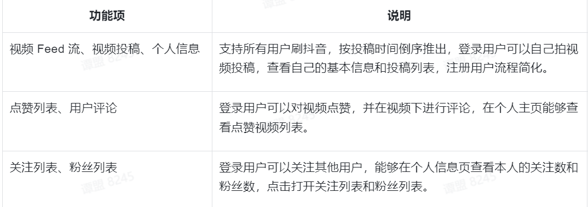

# 极简抖音
一个简单的短视频后台，功能包括视频流，点赞，评论，关注。

## 本地测试
在配置文件中（application-xxx.yaml) 配置数据库和ffmpeg路径(自备ffmepg.exe)

## 接口文档
[地址](https://www.apifox.cn/apidoc/shared-8cc50618-0da6-4d5e-a398-76f3b8f766c5/api-18902517)
